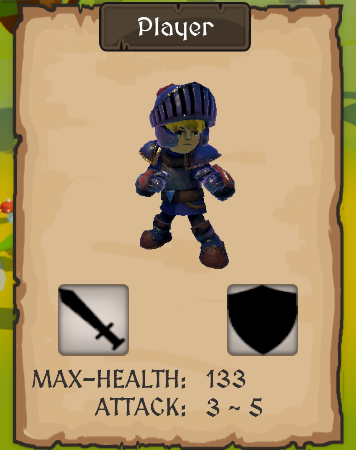

# 3Drpg Game Demo

	
	
    

# 3C

- 玩家通过切换武器来切换攻击数据、模型、动画
- 简单的shader实现遮挡剔除效果——玩家被大世界物体遮挡后更换材质，从而仍可以被看到
- 鼠标控制（根据所点击对象执行移动、追击、拾取等操作）/键盘控制（移动、攻击、拾取物品）
- 第三人称镜头跟随，可旋转和缩放镜头

# 战斗

- 关键帧事件进行攻击结算，暴击可打断受击者动作
- 敌人有站岗、巡逻、追击、攻击四种状态（死亡后）
- 玩家处于怪物前方120°扇形区域内才会被发现和攻击到
- 石头人boss会扔石块攻击玩家，玩家可将其击回对boss造成伤害

# 背包

- 物品拖拽，包括不同物品位置交换与同种物品自动堆叠（解决排放层级、遮挡关系的处理）
- 物品信息ToolTip展示（根据鼠标位置自适应调整ToolTip生成位置）
- 物品拾取，大世界材料与怪物掉落材料（碰撞器+触发器）
- 快捷栏与装备栏（复用背包代码），快捷栏增添了按键使用物品的功能，装备栏增添了更改角色武器的功能（包括更改模型、更改动画、更改攻击数据）
- 滚动视图与对象池（只加载少量格子，格子离开viewport后将其移动到列表末尾，并获取对应序号的物品数据）

# 任务

- 通过与NPC对话来接取任务及领取奖励
- 任务类型包括收集材料、击杀敌人、升级等